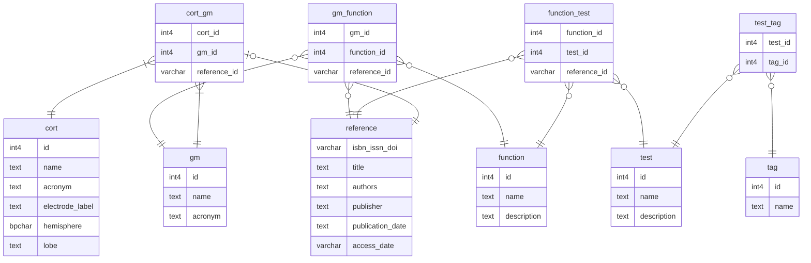
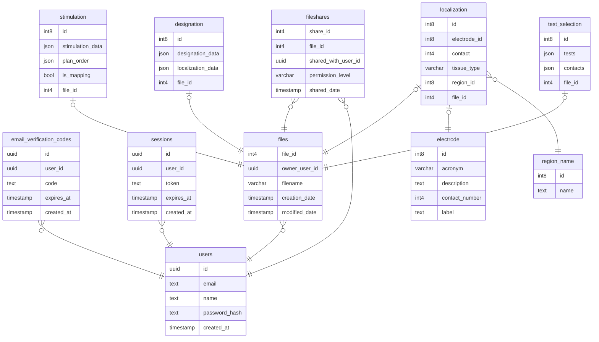

<!--
This README is created based on template available at https://github.com/othneildrew/Best-README-Template
Almost all the comments are left untouched.
-->
<a id="readme-top"></a>


<!-- PROJECT SHIELDS -->
<!--
*** I'm using markdown "reference style" links for readability.
*** Reference links are enclosed in brackets [ ] instead of parentheses ( ).
*** See the bottom of this document for the declaration of the reference variables
*** for contributors-url, forks-url, etc. This is an optional, concise syntax you may use.
*** https://www.markdownguide.org/basic-syntax/#reference-style-links
-->

<!-- PROJECT LOGO -->
<br />
<div align="center">
  <h1> [Wirecracker logo] </h1>
  <!--<a href="https://github.com/github_username/repo_name">
    
  </a>-->

# Wirecracker


[![Contributors][contributors-shield]][contributors-url]
[![Forks][forks-shield]][forks-url]
[![Stargazers][stars-shield]][stars-url]
[![Issues][issues-shield]][issues-url]


  <p align="center">
    A planning tool for epileptologists
    <br />
    <a href="https://www.wirecracker.com/documentations"><strong>Visit documentations</strong></a>
    <br />
    <br />
    <a href="https://www.wirecracker.com">Visit site</a>
    &middot;
    <a href="https://github.com/UCD-193AB-ws24/Wirecracker/issues/new?template=bug_report.md">Report Bug</a>
    &middot;
    <a href="https://github.com/UCD-193AB-ws24/Wirecracker/issues/new?template=feature_request.md">Request Feature</a>
  </p>
</div>


<!-- TABLE OF CONTENTS -->
<details>
  <summary>Table of Contents</summary>
  <ol>
    <li><a href="#about-the-project">About The Project</a></li>
    <li><a href="#usage">Usage</a></li>
    <li>
      <a href="#self-hosting">Self Hosting</a>
      <ul>
        <li><a href="#prerequisites">Prerequisites</a></li>
        <li><a href="#installation">Installation</a></li>
      </ul>
    </li>
    <li><a href="#contributing-guidelines">Contributing</a></li>
    <li><a href="#license">License</a></li>
    <li><a href="#contact">Contact</a></li>
    <li><a href="#acknowledgments">Acknowledgments</a></li>
  </ol>
</details>


<!-- ABOUT THE PROJECT -->
## About The Project

<!-- Screenshot -->
<!-- [![Product Name Screen Shot][product-screenshot]](https://example.com) -->
_[Add screenshot of "home page"]_

Wirecracker provides a intuitive solution for designing, executing, and managing localization and stimulation plans.
Key Development Goalst:
- Replace traditional CSV-based interfaces with a modern, user-friendly GUI for improved usability and efficiency.
- Facilitate smooth communication and data sharing between teams to enhance productivity and reduce errors.
- Build a centralized, well-organized database to store plans, enabling quick retrieval and analysis.

<p align="right">(<a href="#readme-top">back to top</a>)</p>


<!-- USAGE EXAMPLES -->
## Usage

How to use the web app. Additional screenshots and demos. Can be linked to more resources.

_For more examples, please refer to the [Documentation](https://www.wirecracker.com/documentations)_

<p align="right">(<a href="#readme-top">back to top</a>)</p>


<!-- SELF HOSTING -->
## Self Hosting

This section provides a guide for self-hosting. For development, please visit [documentation for developers](https://www.wirecracker.com/documentations/code)

### Prerequisites

Followings are required to host your own Wirecracker
* [node.js](https://nodejs.org/en)
* [npm](https://www.npmjs.com/)
* [supabase setup](https://supabase.com/)
* [Google OAuth 2 token](https://developers.google.com/identity/protocols/oauth2/javascript-implicit-flow)

### Database ERD
You are required to have database with following tables in supabase.
Data we used for core functionality can be located in ```./data``` foulder
#### Core functionality:

#### File share and cloud saving


### Installation

1. Clone the repo
   ```sh
   git clone https://github.com/UCD-193AB-ws24/Wirecracker.git
   ```
2. Go into project folder
   ```sh
   cd Wirecracker
   ```
3. Configure hosting environment variables in `.env`
   
   `./.env`
   ```filename="./.env"
   VITE_SUPABASE_URL=[your url to supabase]
   VITE_SUPABASE_ANON_KEY=[your token for supabase]
   ```
   `./backend/.env`
   ```flename="backend/.env"
   RESEND_API_KEY=[your ... for ...]
   SUPABASE_URL=[your url to supabase. Same as VITE_SUPABASE_URL]
   SUPABASE_KEY=[your token for supabase. Same as VITE_SUPABASE_ANON_KEY]
   GOOGLE_CLIENT_ID=[your id for google auth]
   GOOGLE_CLIENT_SECRET=[your token for google auth]
   SESSION_SECRET=[your ... for ...]
   ```
4. Configure hosting information in `config.json`
   
   `./config.json`
   ```filename="./config.json"
   {
       "port": [back-end port],
       "frontendURL": "[your front-end url]",
       "backendURL": "[your back-end url]"
   }
   ```
5. Install NPM packages for backend and start it
   ```sh
   (cd backend; npm install; npm start)&
   ```
6. Install NPM packages for frontend and start it 
   ```sh
   npm install; npm run dev
   ```

<p align="right">(<a href="#readme-top">back to top</a>)</p>


<!-- CONTRIBUTING -->
<!-- Excerted from Angular repo -->
## Contributing Guidelines

Read our [contributing guidelines][contributing] to learn about our submission process, coding rules, and more.

<p align="right">(<a href="#readme-top">back to top</a>)</p>

### Top contributors:

<a href="https://github.com/UCD-193AB-ws24/Wirecracker/graphs/contributors">
  
</a>


<!-- LICENSE -->
## License

Distributed under the MIT License. See [`LICENSE.txt`][license] for more information.

<p align="right">(<a href="#readme-top">back to top</a>)</p>

## Contact

Support: contact@wirecracker.com

Project Link: [https://github.com/UCD-193AB-ws24/Wirecracker](https://github.com/UCD-193AB-ws24/Wirecracker)

<p align="right">(<a href="#readme-top">back to top</a>)</p>


<!-- ACKNOWLEDGMENTS -->
## Acknowledgments

* [Tools for NIfTI and ANALYZE image](https://www.mathworks.com/matlabcentral/fileexchange/8797-tools-for-nifti-and-analyze-image) by Jimmy Shen

<p align="right">(<a href="#readme-top">back to top</a>)</p>


<!-- MARKDOWN LINKS & IMAGES -->
<!-- https://www.markdownguide.org/basic-syntax/#reference-style-links -->
[contributors-shield]: https://img.shields.io/github/contributors/UCD-193AB-ws24/Wirecracker.svg?style=flat-square&logo=github&logoColor=white"
[contributors-url]: https://github.com/UCD-193AB-ws24/Wirecracker/graphs/contributors
[forks-shield]: https://img.shields.io/github/forks/UCD-193AB-ws24/Wirecracker.svg?style=flat-square&logo=github&logoColor=white"
[forks-url]: https://github.com/UCD-193AB-ws24/Wirecracker/network/members
[stars-shield]: https://img.shields.io/github/stars/UCD-193AB-ws24/Wirecracker.svg?style=flat-square&logo=github&logoColor=white"
[stars-url]: https://github.com/UCD-193AB-ws24/Wirecracker/stargazers
[issues-shield]: https://img.shields.io/github/issues/UCD-193AB-ws24/Wirecracker.svg?style=flat-square&logo=github&logoColor=white"
[issues-url]: https://github.com/UCD-193AB-ws24/Wirecracker/issues
[product-screenshot]: images/screenshot.png
[contributing]: CONTRIBUTING.md
[license]: LICENSE.txt
